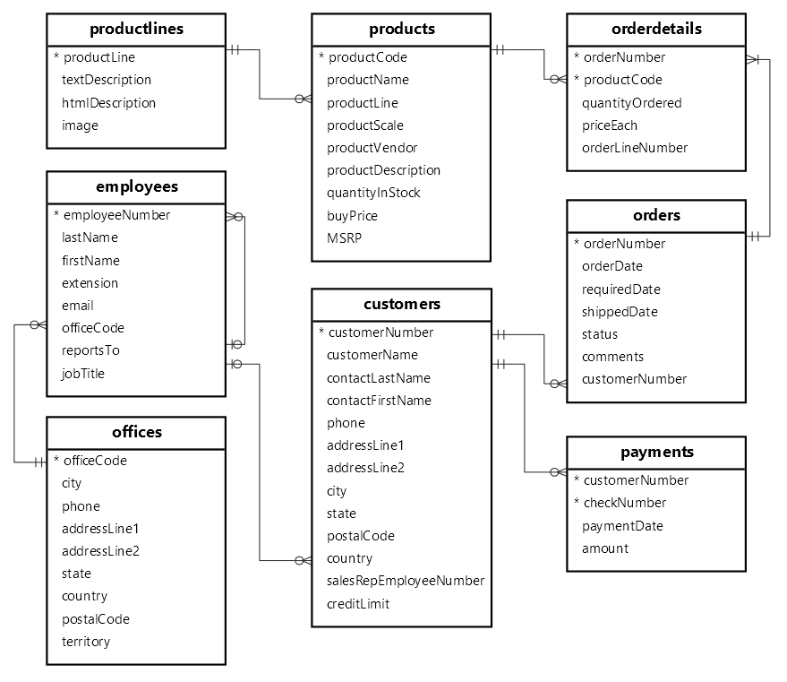

## 📁 Project Structure
```
sql_agent_hybrid/
├── config.py                   # Configuration settings
├── setup_index.py              # One-time indexing script
├── main.py                     # Streamlit UI
│
├── database/
│   ├── connection.py           # Database connection
|   ├── download.db             # script to downlaod DB from Kaggle Hub
│   └── olist_ecommerce.sqlite        # Your database
│
├── indexing/                   # Indexing pipeline
│   ├── schema_extractor.py     # Extract schema with LangChain
│   ├── description_generator.py # Generate descriptions with LLM
│   ├── index_builder.py        # Build FAISS index
│   └── metadata/               # Stored index files
│
├── retrieval/                  # Query-time retrieval
│   └── schema_retriever.py     # Semantic table search
│
├── agent/                      # SQL Agent components
│   ├── sql_agent.py            # Main orchestrator
│   ├── context_builder.py      # Build schema context
│   ├── sql_generator.py        # Generate SQL
│   ├── sql_validator.py        # Validate SQL
│   ├── sql_executor.py         # Execute SQL
│   └── prompts.py              # LLM prompts
│
└── utils/                      # Utilities
    ├── helpers.py              # Helper functions
    └── logger.py               # Logging setup

---



---

uv run python -m database.connection